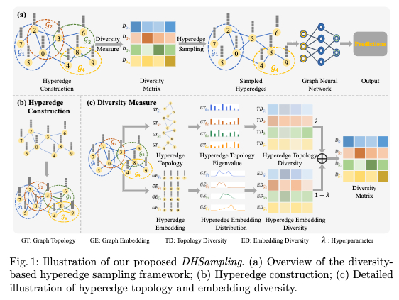

## DHSampling: Diversity-based Hyperedge Sampling in GNN Learning

> "DHSampling: Diversity-based Hyperedge Sampling in GNN Learning with Application to Medical Image Classification", Workshop on _MLMI_, _MICCAI 2024_, [Jiameng Liu, Furkan Pala, <u>Islem Rekik</u>, and <u>Dinggang Shen</u>]



### Install

* Clone this repo and install corresponding requirement in `requirements.txt`

    `git clone https://github.com/basiralab/DHSampling.git`
  
    `pip install -r requirements`

### Data Preparation
We train and validate our proposed DHSampling on two publicly available MedMNIST data (_i.e._,OrganCMNIST, OrganSMNIST). For reproducing the code, you need to download the MedMNIST data and convert to Graph as following:

1. `pip install medmnist`
   1. Download OrganCMNIST and OrganSMNIST data according to this [repo](https://github.com/MedMNIST/MedMNIST)
2. Data preprocess for MedMNIST dataset

    `python ./DataPrepare/Process.py --medmnist_origin /folder/to/original/medmnist --medmnist_target /folder/to/processed/data`
3. Convert processed data to graph

    `python ./DataPrepare/GraphConstruction.py --medmnist_npy /folder/to/processed/data --medmnist_garph /folder/to/save/graph`

### Training and Evaluation


***
This implementation is highly inspired by _ClusterGCN_ in this [Repo](https://github.com/benedekrozemberczki/ClusterGCN)

## [<font color=#F8B48F size=3>License</font> ](./LICENSE)
```
Copyright IDEA Lab, School of Biomedical Engineering, ShanghaiTech University, Shanghai, China. & BASIRA Lab, Department of Computing, Imperical College London

Licensed under the the GPL (General Public License);
you may not use this file except in compliance with the License.
You may obtain a copy of the License at

    http://www.apache.org/licenses/LICENSE-2.0

Repo for Diversity-based Hyperedges Sampling in GNN Learning
Contact: JiamengLiu.PRC@gmail.com
```


